# АРХИТЕКТУРНЫЕ ДИАГРАММЫ И СХЕМЫ
## TwchPlaceholder - Техническая архитектура

### 1. ОБЩАЯ АРХИТЕКТУРА СИСТЕМЫ

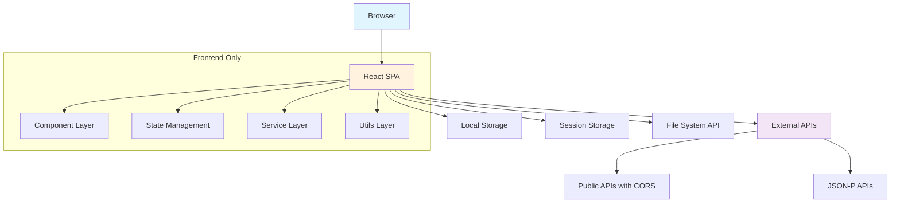

### 2. КОМПОНЕНТНАЯ АРХИТЕКТУРА

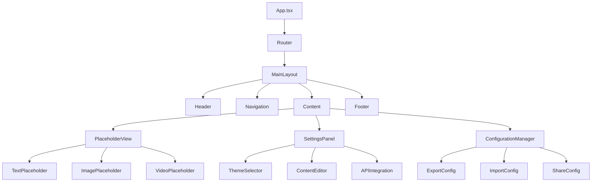

### 3. СХЕМА ПОТОКОВ ДАННЫХ

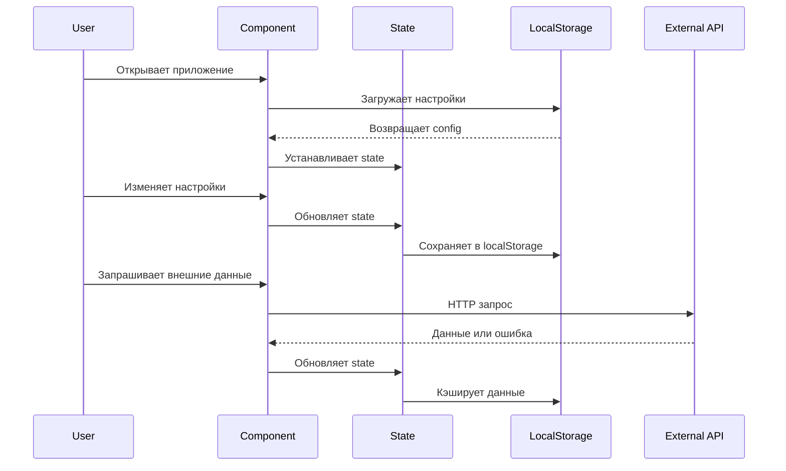

### 4. СТРУКТУРА ДАННЫХ В LOCALSTORAGE

```typescript
interface AppConfig {
  version: string;
  settings: {
    theme: 'light' | 'dark';
    language: string;
    autoSave: boolean;
  };
  placeholders: PlaceholderConfig[];
  cache: {
    [apiUrl: string]: {
      data: any;
      timestamp: number;
      ttl: number;
    };
  };
  history: ActionHistory[];
}

interface PlaceholderConfig {
  id: string;
  name: string;
  type: 'text' | 'image' | 'video' | 'api';
  content: {
    text?: string;
    imageUrl?: string;
    videoUrl?: string;
    apiConfig?: APIConfig;
  };
  styling: {
    backgroundColor: string;
    textColor: string;
    fontSize: string;
    fontFamily: string;
  };
  created: string;
  modified: string;
}

interface APIConfig {
  url: string;
  method: 'GET' | 'POST';
  headers?: Record<string, string>;
  params?: Record<string, any>;
  dataPath?: string; // JSONPath для извлечения данных
  refreshInterval?: number; // в секундах
}
```

### 5. СХЕМА ОБРАБОТКИ ОШИБОК

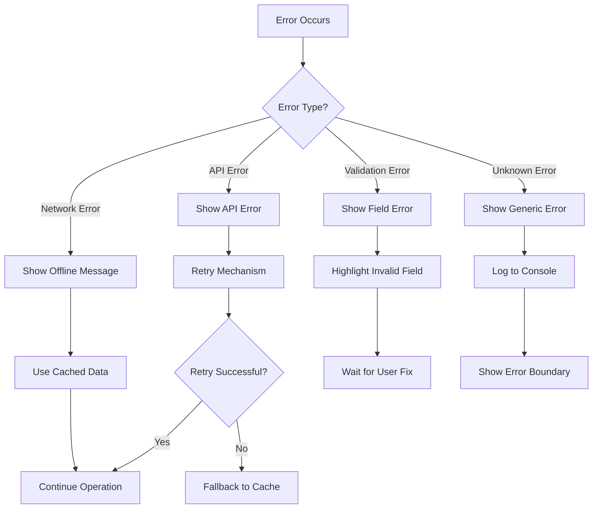

### 6. ЖИЗНЕННЫЙ ЦИКЛ PLACEHOLDER

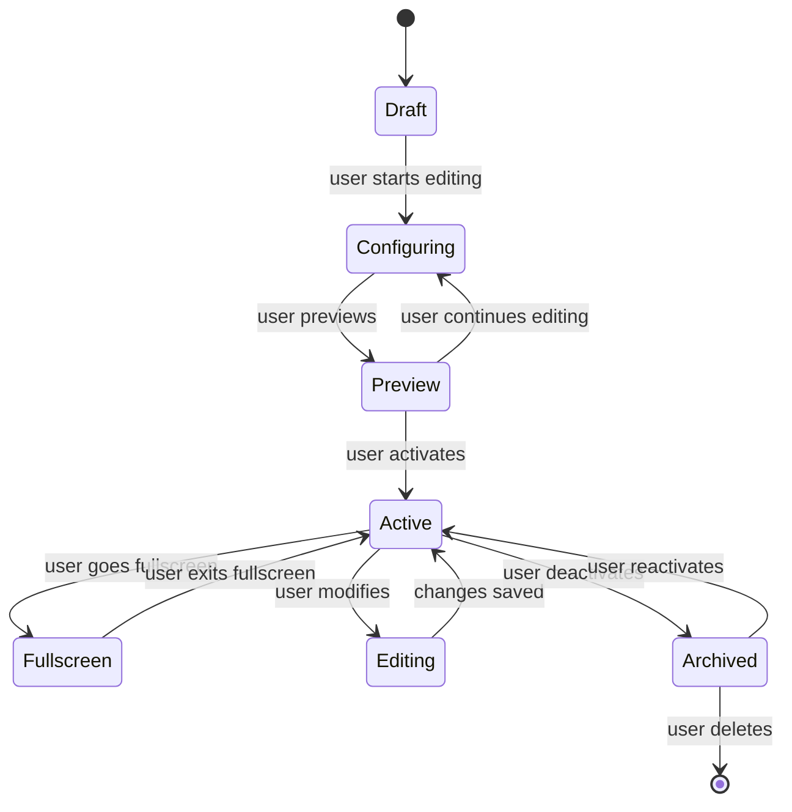

### 7. СХЕМА ИНТЕГРАЦИИ С ВНЕШНИМИ API

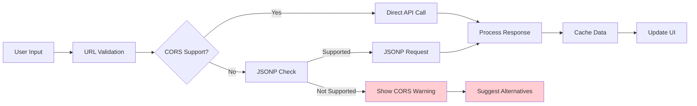

### 8. СХЕМА ЭКСПОРТА/ИМПОРТА КОНФИГУРАЦИИ

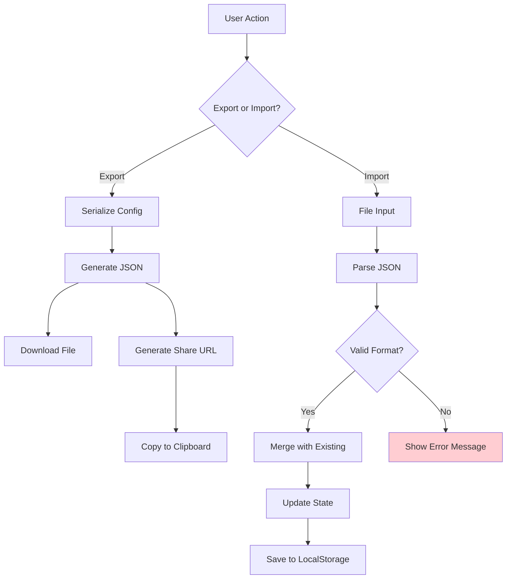

### 9. СХЕМА ОБРАБОТКИ ФАЙЛОВ

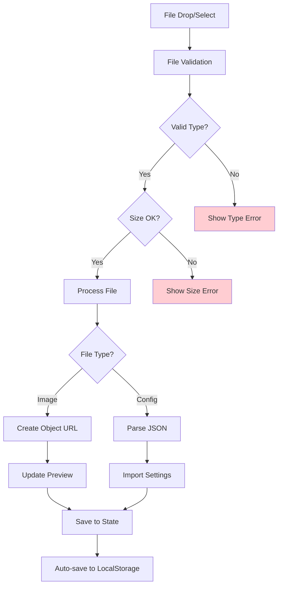

### 10. СХЕМА ПРОИЗВОДИТЕЛЬНОСТИ

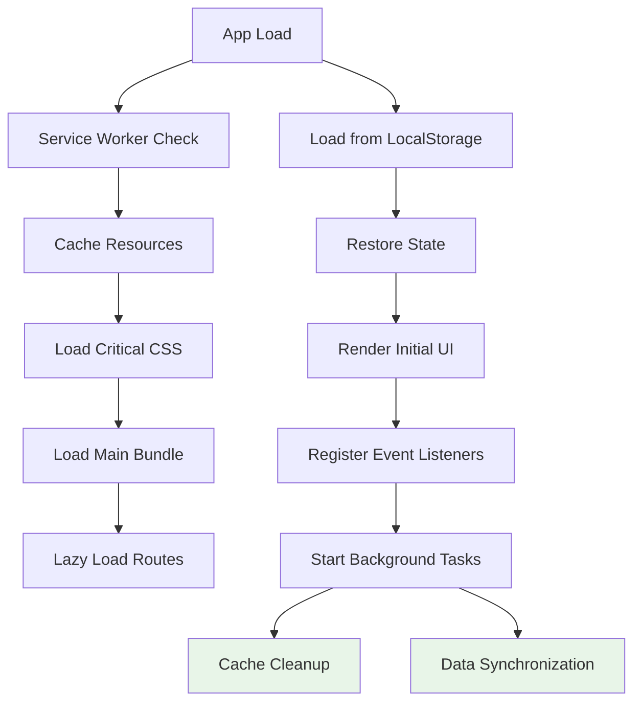

### 11. СХЕМА АДАПТИВНОСТИ

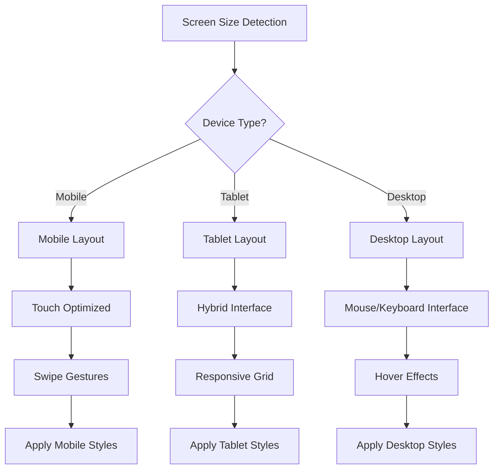

### 12. СХЕМА БЕЗОПАСНОСТИ (CLIENT-SIDE)

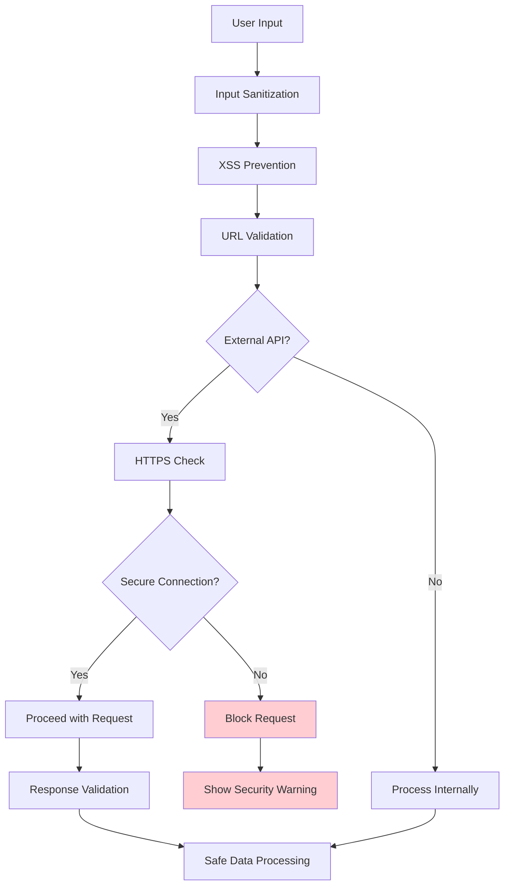

---

## ТЕХНИЧЕСКИЕ ПРИМЕЧАНИЯ

### Ключевые архитектурные решения:

1. **Полностью клиентское решение** - отсутствие серверной части
2. **Модульная архитектура** - легкость расширения и поддержки
3. **Кэширование на клиенте** - повышение производительности
4. **Graceful degradation** - работа при ограничениях сети
5. **Progressive Enhancement** - улучшение UX при наличии возможностей

### Паттерны проектирования:
- **Observer Pattern** - для обновления UI при изменении состояния
- **Strategy Pattern** - для различных типов placeholder
- **Factory Pattern** - для создания компонентов
- **Singleton Pattern** - для управления настройками приложения

### Оптимизации:
- **Code Splitting** - разделение кода по маршрутам
- **Tree Shaking** - удаление неиспользуемого кода
- **Memoization** - кэширование результатов вычислений
- **Virtual Scrolling** - для больших списков (если применимо)